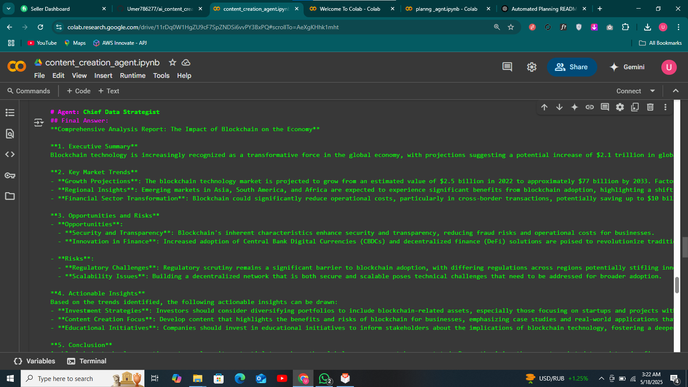

# 🧠 AI Content Creation Agent System

This project demonstrates a multi-agent collaborative content creation workflow using [CrewAI](https://github.com/joaomdmoura/crewAI). The system simulates a Writer, Editor, and Publisher working together to generate, edit, and prepare content for publishing.

## 🚀 Project Overview

The notebook orchestrates an autonomous content creation process involving:

- ✍️ **Writer Agent** — generates a first draft based on the topic
- 🛠️ **Editor Agent** — reviews and improves the draft
- 📢 **Publisher Agent** — formats and finalizes the content

Each agent works in a structured sequence, facilitated by the CrewAI framework.

## 🖼️ Screenshot



> *(Make sure the image is in the same directory or update the path accordingly.)*

## 📦 Features

- Modular agents with clear roles
- Natural language generation pipeline
- Fully automated collaborative flow
- Easily customizable for different content formats (e.g., blogs, newsletters)

## 🛠️ Tech Stack

- Python
- [CrewAI](https://github.com/joaomdmoura/crewAI)
- Jupyter Notebook

## 🔧 Setup Instructions

1. Clone the repo or download the notebook:
    ```bash
    git clone https://github.com/your-username/your-repo-name.git
    ```

2. Install dependencies:
    ```bash
    pip install crewai
    ```

3. Run the Jupyter Notebook:
    ```bash
    jupyter notebook content_creation_agent.ipynb
    ```

4. Optionally, adjust agent prompts and tasks in the code.

## 🧪 Example Workflow

```python
from crewai import Agent, Task, Crew

writer = Agent(role="Writer", ...)
editor = Agent(role="Editor", ...)
publisher = Agent(role="Publisher", ...)

tasks = [
    Task(description="Draft the article", agent=writer),
    Task(description="Edit and enhance the draft", agent=editor),
    Task(description="Format and prepare for publishing", agent=publisher)
]

crew = Crew(agents=[writer, editor, publisher], tasks=tasks)
crew.run()
